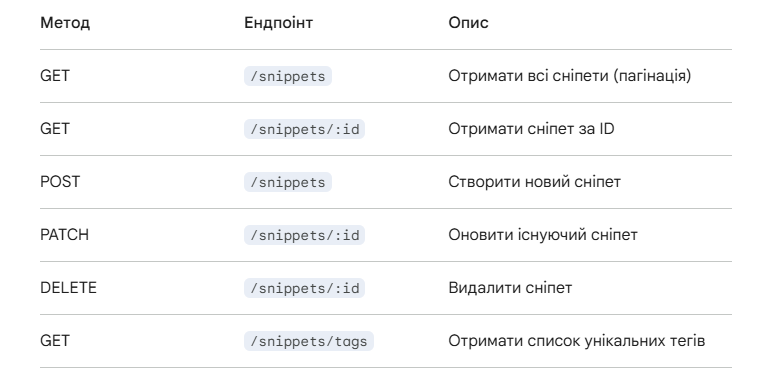

# Snippet Manager — Full Stack Application

Додаток для зберігання та керування фрагментами коду (сніпетами). Побудований на технологіях **NestJS** (бекенд), **Next.js** (фронтенд) та **MongoDB**.

---

## 🛠 Технологічний стек
- **Frontend**: Next.js 14+ (App Router), TanStack Query, Axios, Tailwind CSS, React Hook Form, Zod.
- **Backend**: NestJS, Mongoose (MongoDB), Class-validator.
- **Database**: MongoDB.

---

## 🚀 Як запустити локально

Для запуску проекту потрібно відкрити два термінали: один для бекенду, інший для фронтенду.

### 1. Бекенд (Backend)
1. Перейдіть у папку бекенду: `cd back`
2. Встановіть залежності: `npm install`
3. Налаштуйте змінні оточення (див. розділ нижче).
4. Запустіть сервер: `npm run start:dev`
   - Сервер працюватиме на: `http://localhost:4000`

### 2. Фронтенд (Frontend)
1. Перейдіть у папку фронтенду: `cd front`
2. Встановіть залежності: `npm install`
3. Налаштуйте змінні оточення (див. розділ нижче).
4. Запустіть проект: `npm run dev`
   - Додаток буде доступний на: `http://localhost:3000`

---

## ⚙️ Змінні оточення (.env.example)

### Backend (`/back/.env`)
Створіть файл `.env` у папці `backend` та додайте:
```env
MONGODB_URI=mongodb+srv://<user>:<password>@cluster.mongodb.net/snippets
PORT=4000

### Frontend (`/front/.env`)
Створіть файл `.env` у папці `front` та додайте:
```env
NEXT_PUBLIC_API_URL=http://localhost:4000



Білд та Production режим
    Для фронтенду (Next.js):
    Bash
    cd frontend
    npm run build
    npm run start
Для бекенду (NestJS):
    Bash
    cd backend
    npm run build
    npm run start:prod